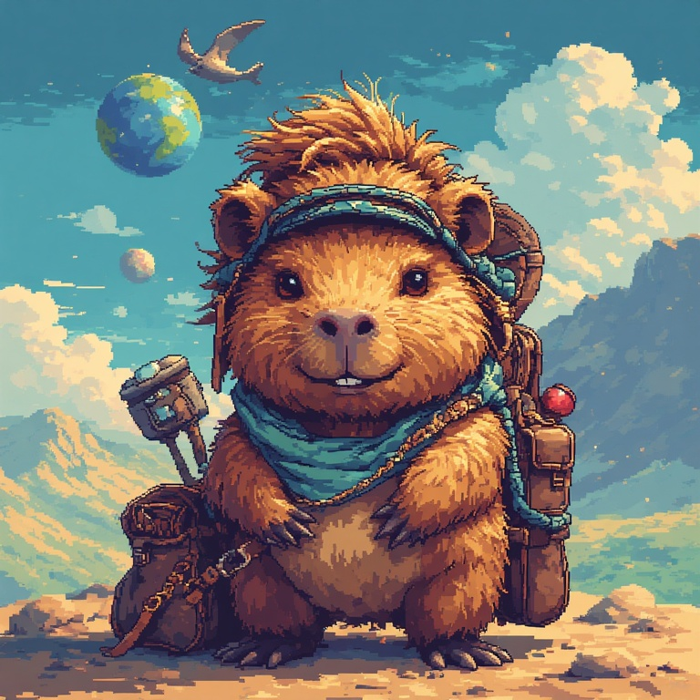

# 🌍 World Spinner

A geography-based educational adventure game where young explorers unlock countries, discover fascinating facts about animals, foods, cultures, and world history.

> **TL;DR** 🎮 Browser game for ages **7-12** • Open source (GPLv3) • 5 countries to explore • Intellectually stimulating without oversimplification • Translation-ready for global education

**🎮 [Play Now at worldspinner.org](https://worldspinner.org)**

## 🎯 About

World Spinner is an interactive browser game designed for children aged 7-12. Players spin a virtual globe to reveal mystery countries, solve progressive clues, and collect discovery cards filled with age-appropriate educational content.

The game uses intellectually stimulating language without oversimplification, encouraging curiosity and deeper learning through exploration.

## ✨ Features (v0.1.1)

- 🎡 **Spin the Globe**: Random country selection with smooth animations
- 🕵️ **Progressive Clues**: Three hints per country (animal, food, flag)
- ✍️ **Guess & Learn**: Case-insensitive validation with country name aliases
- 🎉 **Discovery Cards**: Educational facts about each unlocked country
- 📱 **Responsive Design**: Works seamlessly on phones, tablets, and laptops
- 🎨 **Polished UI**: Teal color theme with Framer Motion animations

## 🛠️ Tech Stack

- **Frontend**: React (JavaScript)
- **Build Tool**: Vite (fast dev server, instant HMR)
- **Styling**: Tailwind CSS
- **Animations**: Framer Motion
- **Testing**: Jest (≥80% coverage)
- **Linting**: ESLint with Airbnb config
- **Formatting**: Prettier (120 char line length)

See [Stack.md](./Stack.md) for complete technical specifications.

## 📁 Project Structure

```
WorldSpinner/
├── app/                    # React application
│   ├── src/                # Source code
│   ├── public/             # Static assets
│   └── package.json        # Dependencies
├── Ideas.md                # Feature ideas and future enhancements
├── Backlog.md              # User stories and development tasks
├── Stack.md                # Technology stack decisions
├── CHANGELOG.md            # Version history
└── README.md               # This file
```

## 🚀 Getting Started

### Prerequisites

- Node.js (v18 or higher)
- npm or yarn

### Installation

```bash
# Clone the repository
git clone https://github.com/zosorock/worldspinner.git

cd worldspinner/app

# Install dependencies
npm install

# Start development server
npm start
```

The game will open at `http://localhost:5173`

### Running Tests

```bash
cd app
npm test              # Run tests in watch mode
npm run test:coverage # Generate coverage report
```

### Building for Production

```bash
cd app
npm run build  # Outputs to app/dist/
```

## 🌐 Contributing

We welcome contributions, especially translations! World Spinner is designed to be easily translatable so children around the world can learn geography in their native language.

### Translation Support

Translation infrastructure is now in place! The game includes:
- `app/src/locales/` directory with translation JSON files
- English (`en.json`) and Spanish (`es.json`) translations
- Structured format (max 2 levels deep) for easy maintenance
- `_README.json` with guidelines for adding new languages

To add a new language:
1. Copy `app/src/locales/en.json` to `<language-code>.json` (e.g., `fr.json` for French)
2. Translate the values while keeping keys in English
3. Run `npm test` to verify structure matches
4. Submit a pull request

See `app/src/locales/_README.json` for detailed guidelines.

### Development Workflow

1. Check [Backlog.md](./Backlog.md) for current user stories
2. Review [Ideas.md](./Ideas.md) for feature ideas
3. Follow the tech stack in [Stack.md](./Stack.md)
4. Ensure tests pass and coverage stays ≥80%
5. Follow Airbnb JavaScript Style Guide

## 🗺️ Roadmap

### v0.2.0 (Planned)
- 🦫 **Capytan the Capybara**: Friendly game host character
- 🌐 **Internationalization**: Translation support for multiple languages
- 🏆 **Progression System**: Continental badges and explorer levels

See [Ideas.md](./Ideas.md) for all planned features.

## 🙏 Acknowledgments

This game was entirely inspired by eldest son, Liam, boundless love for learning, with contributions from my creative director, Nolan (my youngest) and advise, supervision, and production assistance from my lovely and multi-talented wife, Carolina. You three are the best thing that ever happened to me. 🥰

Built with curiosity, exploration, and a love of learning in mind.

## 📄 License

World Spinner is dual-licensed:

- **Source Code**: Licensed under [GPLv3](./LICENSE.md) - Free to use, modify, and share. If you distribute your version, you must share the source code under the same terms.
- **Game Assets**: Licensed under [CC BY-NC-SA 4.0](./ASSETS_LICENSE.md) - Free to remix and share for non-commercial purposes with attribution.

See [LICENSE.md](./LICENSE.md) and [ASSETS_LICENSE.md](./ASSETS_LICENSE.md) for complete details.